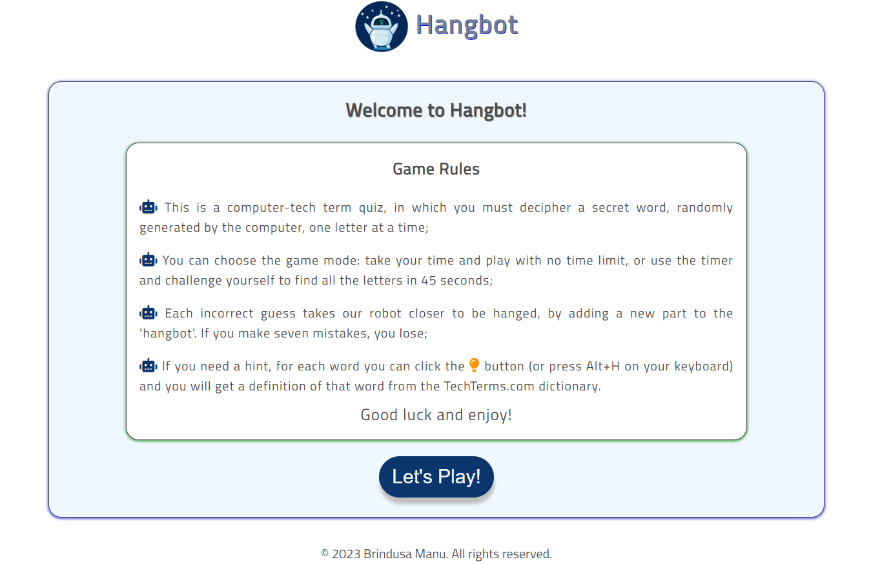

# Hangbot

Welcome to [Hangbot](https://brindusa22.github.io/Hangbot/game.html)!
This a hangman-inspired game with a focus on computer tech terms. The user has the task to guess a secret word, by selecting the letters from the virtual keyboard and has seven chances. In addition the game features some useful options: a timer, to be able to play the game with a countdown and a hint button with the definition of the secret word. 
It was designed to be both a game and an interactive quiz, for tech enthusiasts who want to challenge their knowledge of tech terms in a playful and engaging way. 

 

 ## Mockup

 The mockup for this game was created with [MockFlow](https://wireframepro.mockflow.com/#/space/default).
 
 

 ## Layout and Design

 - The fonts I have used are _Titillium Web_  and _Orbitron_  which offer a very good readability. Their geometric shapes and sharp corners of the characters make them suitable for the robotic theme of the game, as they give a futuristic and mechanical touch.
 -  The colors I have used are _Alice blue_ -#F0F8FF for the background of the game area and a _Navy blue_ #0A356D for the buttons. All the buttons have shaddows and hover effects and the colors that I have applied to them are consistent throughout the entire project to create a clean but modern appearance.

### Logo

The logo was created with [Canva](https://www.canva.com/logos/). It has the same main colors of the game and its round shape is meant to resemble the virtual keyboard buttons and the hint button. It was also used as a _favicon_. When clicked it takes the user to the rules page.

### Images and Icons

- The _hangbot_ image was taken from [Vecteezy](https://www.vecteezy.com/vector-art/10361091-simple-vector-drawing-in-doodle-style-robot-cute-robot-hand-drawn-with-lines-funny-illustration-for-kids) and mofified with _Paint_ to meet the design requirements of the game. 
- 
  
  
- The icons were taken from [FontAwesome](https://fontawesome.com/search) and their style was costumized according to the design of the game.

## Features

### Existing Features

-The game opens with the _Welcome page_ which contains the rules and a big _Play_ button that invites the user to start the game.

-

