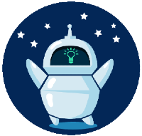

# Hangbot

Welcome to [Hangbot](https://brindusa22.github.io/Hangbot/game.html)!
This a hangman-inspired game with a focus on computer tech terms. The user has the task to guess a secret word, by selecting the letters from the virtual keyboard and has seven chances. In addition the game features some useful options: a timer, to be able to play the game with a countdown and a hint button with the definition of the secret word. 
It was designed to be both a game and an interactive quiz, for tech enthusiasts who want to challenge their knowledge of tech terms in a playful and engaging way. 

 

 ## Mockup

 The mockup for this game was created with [MockFlow](https://wireframepro.mockflow.com/#/space/default).
 
 

 ## Layout and Design

 - The fonts I have used are _Titillium Web_  and _Orbitron_  which offer a very good readability. Their geometric shapes and sharp corners of the characters make them suitable for the robotic theme of the game, as they give a futuristic and mechanical touch.
 -  The colors I have used are _Alice blue_ -#F0F8FF for the background of the game area and a _Navy blue_ #0A356D for the buttons. All the buttons have shaddows and hover effects and the colors that I have applied to them are consistent throughout the entire project to create a clean but modern appearance.

### Logo

The logo was created with [Canva](https://www.canva.com/logos/). It has the same main colors of the game and its round shape is meant to resemble the virtual keyboard buttons and the hint button. It was also used as a _favicon_. When clicked it takes the user to the rules page.

### Images and Icons

- The _hangbot_ image was taken from [Vecteezy](https://www.vecteezy.com/vector-art/10361091-simple-vector-drawing-in-doodle-style-robot-cute-robot-hand-drawn-with-lines-funny-illustration-for-kids) and mofified with _Paint_ to meet the design requirements of the game. 
- 
  
  
- The icons were taken from [FontAwesome](https://fontawesome.com/search) and their style was costumized according to the design of the game.

## Features

### Existing Features

- Welcome page 

    The  site opens with the _Welcome page_ which contains the rules and a big _Play_ button that invites the user to start the game.

- The game page
  
    To maintain a consistency, the game page has the same structure as the welcome page.
  
    - Logo and heading
  
       - The header, displays the logo and the heading with the name of the game, which is also a clickable link that takes the user to the initial page, namely the welcome / rules page.

    - Control buttons

         - Above the game window, the user can easily find all the control buttons of the game: on the right side, the restart button and the rules button, which takes him again to the rules page, and on the left side the timer switch, which gives the user the possibility to activate and deactivate a 45 second timer. The buttons have the same style including the same hover effect.
  
        

    - Game window 

      - As mentioned above, the game window maintains the same visual aspect, in terms of styling, as the welcome / rules area. Its structure is divided into two main areas.
      -  On the right side, the input area where the user can choose one letter at a time from a virtual keyboard, or press the hint button (which can also be triggered using the Alt+h keys on the computer keyboard) to get the deffinition of the secret word. The letters can only be clicked once. After a letter has been clicked, its button turns green or red, depending if the guess was correct or not, and the button is then disabled, alowing the user to concentrate only on the still possible options. 
      - On the left side, the output area is displaying a hangbot image that is updated with every letter- click of the user. At the bottom of this output area there is a chances left counter, consisting of seven small robot icons. Each time a mistake is made, a robot icon is subtracted from the chances-left counter.
       
        
    
      - The user is allowed a total of six mistakes. At the seventh mistake, the game is over and a game-over message appears, revealing the correct answer. Underneath the message there is a big _Play Again_ button, encouraging the user to restart the game.
      - If all the letters are correctly guessed and no more then six mistakes were made, the user wins and a congratulatory message pops up, again with a _Play_ button, offering the user the possibility to play again.
       
        

      - Timer

        - If the user prefers to increase the level of diffculty, the timer button can be switchd on and a 45 seconds countdown will appear just above the secret word. If the timer is switched off during a timed game, the page will refresh and the game will resume with the timer deactivated.
         
        

        - When the time is up and the user has not guessed the word, the game is over and a _Time's up_ notification pops up.
        - If the secret word was guessed in 45 seconds and again with no more than six mistakes, a congratulatory message appears, letting the user know how much time left he had.
         
            
        
      - Hint Button

        - The hint button provides a definition of the secret word from the TechTerm.com dictionary. It is located directly under the virtual keyboard and is suggestively represented by a lightbulb that is _lightened_ when it is turned on.. It can be used at any time and can be also activated with the Alt + h keys from the computer keyboard.
         
         
        
 ### Future Features

  - Add levels and increase the difficulty of the words gradually.
